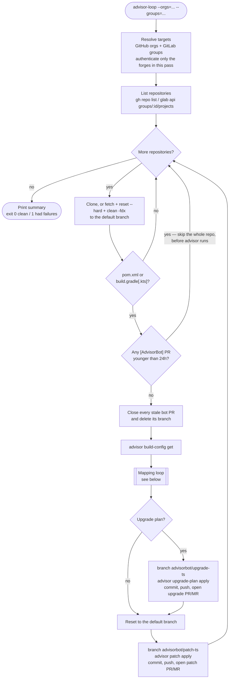
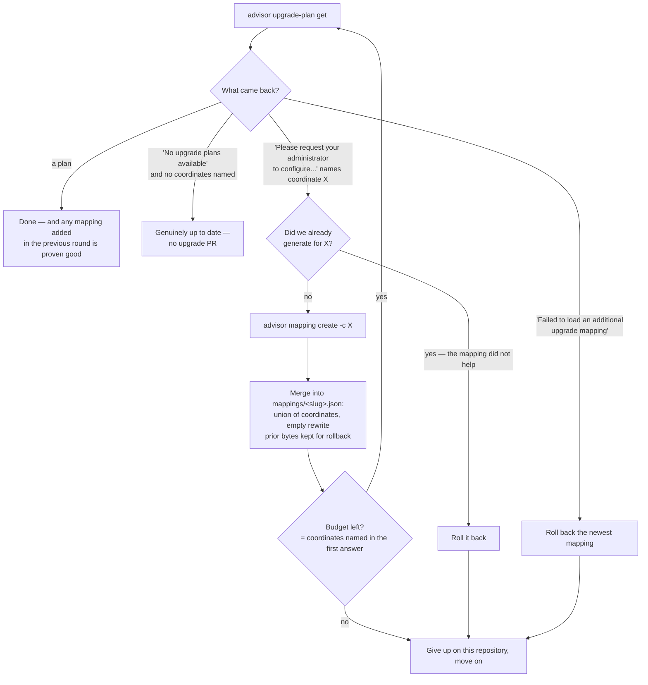

# advisor-loop

A reference implementation of running [Tanzu Application Advisor](https://techdocs.broadcom.com/us/en/vmware-tanzu/spring/application-advisor/1-6/app-advisor/index.html)
at scale. It walks every repository in a set of GitHub organizations and GitLab groups **once**, runs
advisor 1.6.7 against each Maven or Gradle project, opens pull requests for what it finds, and stops.
Nothing daemonizes and nothing is scheduled — you run the pass again when you want another one.

The output is the whole user interface: `Org/Repo - activity - status`, one line per activity.

```
$ java -jar target/advisor-loop.jar --groups=dashaun-live

ORG/REPO                                             ACTIVITY             STATUS
---------------------------------------------------- -------------------- ------
dashaun-live/live.dashaun.service.config             build-config get     success
dashaun-live/live.dashaun.service.config             upgrade-plan get     success
dashaun-live/live.dashaun.service.config             apply patch          success
dashaun-live/live.dashaun.service.config             patch MR             success
dashaun-live/live.dashaun.gateway.routing            build-config get     success
dashaun-live/live.dashaun.gateway.routing            upgrade-plan get     success
dashaun-live/live.dashaun.gateway.routing            apply patch          success
dashaun-live/live.dashaun.gateway.routing            patch MR             success
dashaun-live/live.dashaun.mvc.hello                  fresh MR             skip

11 success, 1 fail, 1 skip
```

A repository with no build file produces no lines at all. `fresh PR` / `fresh MR` means an existing
bot request is under 24 hours old, so the repository was skipped before advisor ran. Statuses are only
ever `success`, `fail`, or `skip`.

## The loop

The outer loop walks every namespace you point it at, one repository at a time. The inner loop is
advisor's own conversation about missing mappings.



Two properties of that shape are deliberate. The fresh-PR check is **repo-wide**: any bot PR under 24
hours old skips the repository before advisor runs, which is what makes a re-run cheap — advisor is
minutes per repository, everything else is seconds. And the upgrade and patch branches are both cut
from the default branch, so they never stack and "no upgrade available" still yields a patch PR.

## The mapping loop

Advisor can only upgrade a dependency it has a *mapping* for. When it lacks one it says so and
produces no plan, which is where most large-scale runs quietly stall. advisor-loop closes that gap:
it reads the coordinates advisor asked for, generates a mapping for each with `advisor mapping create`,
and asks again — so `upgrade-plan get` is both the driver and the validator of its own mappings.



Mappings live on the local filesystem at `.workspace/mappings` — there is no mappings git repo and no
mapping PRs. Advisor is pointed at that folder for every invocation, with `override` so these mappings
layer on top of the built-in ones rather than replacing them:

```
SPRING_ADVISOR_MAPPING_CUSTOM_0_FILEPATH=<abs>/.workspace/mappings
SPRING_ADVISOR_MAPPING_CUSTOM_0_MERGE_STRATEGY=override
```

Each file keeps a `slug`, the union of coordinates learned for it, and a deliberately **empty**
`rewrite` block, so advisor's own version graph and upgrade recipes survive:

```json
{ "slug": "spring-boot",
  "coordinates": [ "org.springframework.boot:spring-boot-grpc-server", "..." ],
  "rewrite": {} }
```

**The store is global.** Mappings apply to every repository on both forges, so one repository's turn
changes what every later repository sees — a GitLab project took its upgrade MR using mappings
generated entirely from GitHub repositories. That reach is the point, and the rollback path is the
guard on it.

`AGENTS.md` explains why the `rewrite` block must be empty, why a mapping is never keyed by anything
but its slug, and which projects this cannot help.

## Running

```sh
export JAVA_HOME=$(sdk home java 21.0.11-librca)
mvn package

java -jar target/advisor-loop.jar                     # namespaces from application.yml
java -jar target/advisor-loop.jar --orgs=foo,bar      # GitHub organizations
java -jar target/advisor-loop.jar --groups=x,y        # GitLab groups
java -jar target/advisor-loop.jar --orgs=a --groups=b # both forges in one pass
java -jar target/advisor-loop.jar --repos=one,two     # restrict to named repositories
java -jar target/advisor-loop.jar --staleness=1h      # recreate bot PRs older than 1h (default 24h)
java -jar target/advisor-loop.jar --dry-run           # clone and analyse, never push or open anything
```

`--repos` accepts either the bare repository name or the full `namespace/name` slug, case-insensitive,
and works on both forges. It is the way to inspect what the bot produces on one repository before
turning it loose on a whole namespace:

```sh
java -jar target/advisor-loop.jar --groups=my-group --repos=my-service --dry-run
```

Exit codes: `0` clean pass, `1` the pass completed with at least one failed activity, `2` the pass could not start (nothing configured to crawl, a forge CLI missing or unauthenticated, or another run holds the lock).

Prerequisites: `advisor` 1.6.7 and `git` on `PATH`, plus the CLI for each forge you target — `gh auth login` for GitHub, `glab auth login` for GitLab (verified against glab 1.114.0). Only the forges actually in the run are checked, so GitHub-only users never need `glab`.

## GitLab

GitLab support is symmetric with GitHub: same state machine, same `[AdvisorBot]` prefix, same 24-hour staleness rule. Merge requests are called MRs in the output, so you see `upgrade MR` and `patch MR` instead of `upgrade PR`.

```yaml
advisor:
  gitlab:
    groups: [my-group]        # or --groups=my-group
    host: gitlab.com          # set to your instance for self-hosted
    binary: glab
    include-subgroups: true   # descend into subgroups
```

Everything goes through `glab api` against GitLab's v4 REST API rather than the porcelain commands, because the porcelain output format varies between glab versions and some of it prompts interactively. Self-hosted instances work by setting `advisor.gitlab.host`; it is threaded through the clone URLs, the `glab --hostname` flag, and the git credential helper.

## Workspace layout

```
.workspace/
  .lock                  # single-instance guard
  advisor-loop.log       # everything diagnostic, at DEBUG
  mappings/              # the local mapping store advisor reads
  .mapping-work/         # scratch dir for `advisor mapping create`
  <org>/<repo>/          # one persistent clone per repository
```

Everything is relative to the working directory, so `.workspace` lands next to the jar you ran from.

Clones use HTTPS and delegate credentials to the forge's own CLI (`gh auth git-credential` or
`glab auth git-credential`), so a push works even on a machine set up only for SSH — set on the clone,
never in your global git config. Advisor's own droppings (`.advisor/`, `target/`, `build/`) are
registered in each clone's `.git/info/exclude` after every refresh, so they never reach a pull request.
That only covers *untracked* files: a repository that **commits** a generated file (seen in the wild
with `.git-versioned-pom.xml` from a git-versioning Maven extension) will see it rewritten by the build
and carried into the PR. The fix belongs in that repository's `.gitignore`.

## Configuration

All settings live under `advisor:` in `src/main/resources/application.yml` and can be overridden on the command line, e.g. `--advisor.staleness=PT6H`.

| Key | Default | Meaning |
| --- | --- | --- |
| `orgs` | `[dashaun-demo]` | GitHub organizations to crawl |
| `gitlab.groups` | `[]` | GitLab groups to crawl |
| `gitlab.host` | `gitlab.com` | GitLab instance, for self-hosted |
| `gitlab.include-subgroups` | `true` | Descend into GitLab subgroups |
| `gitlab.binary` | `glab` | GitLab CLI to shell out to |
| `github-host` | `github.com` | GitHub host used for clone URLs and credentials |
| `gh-binary` | `gh` | GitHub CLI to shell out to |
| `default-branch-fallback` | `main` | Used only when the forge does not report a default branch |
| `staleness` | `PT24H` | Age at which a bot PR is deleted and recreated. Override per run with `--staleness=1h` (plain or ISO-8601; `0s` forces every bot PR to be recreated) |
| `workspace` | `${user.dir}/.workspace` | Root of all work |
| `bot-prefix` | `[AdvisorBot]` | Title prefix identifying this bot's PRs |
| `skip-archived` | `true` | Ignore archived repos |
| `skip-forks` | `false` | `dashaun-demo` is entirely forks, so forks are in scope |
| `mappings.merge-strategy` | `override` | Advisor merge strategy for the local store |
| `error-rules` | see yaml | Regexes mapping advisor error text to an action |

`error-rules` is the part most likely to need tuning: it turns advisor's error text into either `MISSING_MAPPING` (with the coordinate to generate) or `BAD_MAPPING` (roll back). New advisor phrasings can be handled by adding a regex, without touching code.

## Troubleshooting

The activity table owns the console, so there is no console logging at all. Everything diagnostic —
including the `git`/`gh`/`advisor` stderr behind any `fail` — goes to `.workspace/advisor-loop.log`
(override the path with `ADVISOR_LOOP_LOG`). When an activity reports `fail`, grep that file for the
repository name.

To retry, just re-run the same namespace: a repository with any bot PR under 24 hours old is skipped
*before* advisor runs, so a re-run only pays for the repositories that still need something, and last
pass's failures — which have no PR — are retried in full. Narrow it with `--repos`.

**Pushes fail transiently.** Both forges have rejected a push once and then accepted the identical
push on the next pass with nothing changed in between — GitHub with a plain failure, GitLab with
`pre-receive hook declined`. There is no retry in the code today, so a transient failure costs that
repository its PR until the next pass. If you see a lone `patch PR fail` or `patch MR fail`, re-run
that repository before hunting for a cause:

```sh
java -jar target/advisor-loop.jar --groups=my-group --repos=the-one-that-failed
```

## Internals

`AGENTS.md` documents the architecture, the exact behaviour of advisor 1.6.7 that this code is built
around, the design decisions that must not be undone, and which paths have actually been exercised
against real repositories.
